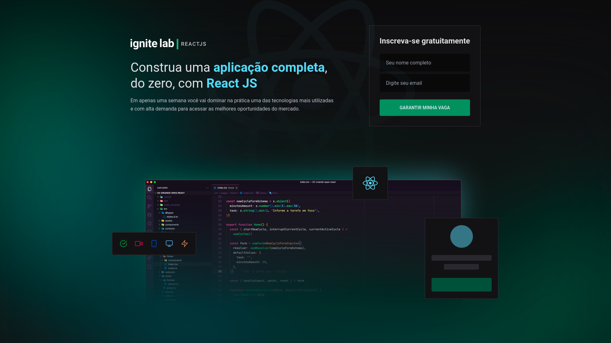

<h1 align="center">
  
</h1>

<p align="center">
  
  
</p>

<br />



<br />

# :computer: Tecnologias

- [React](https://reactjs.org/)
- [Typescript](https://www.typescriptlang.org/)
- [Tailwind CSS](https://tailwindcss.com)
- [React Router](https://reactrouter.com)
- [GraphQL](https://graphql.org)
- [GraphCMS](https://graphcms.com)
- [Phosphor](https://phosphoricons.com)
- [Apollo Client](https://www.apollographql.com)
- [Vime](https://vimejs.com)

# :construction_worker: Executando
​
```bash
## Clonar o repositório
​
git clone git@github.com:martinsgabriel1956/ignite-lab-platform.git
​
# ou
​
git clone https://github.com/martinsgabriel1956/ignite-lab-platform.git
​
## Instale as dependências
​
npm i/install
​
# ou
​
yarn

​
## Execute o projeto
​
npm run start

# ou

yarn start

# :memo: Licença

```

# :memo: Licença

Esse projeto está sob a licença MIT. Veja o arquivo [LICENSE](LICENSE.md) para mais detalhes.